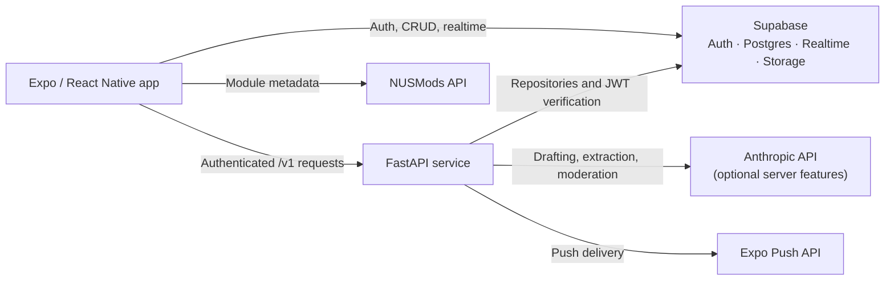

<p align="center">
  
</p>

<h1 align="center">NUSLink</h1>

<p align="center">
  Find the right people to study, build, and compete with at NUS.
</p>

<p align="center">
  <strong>Orbital 2026 · Apollo 11</strong>
</p>

NUSLink is a cross-platform mobile app that helps National University of Singapore students form study groups, project teams, competition squads, and academic communities. It combines module enrolment, timetable availability, academic goals, and working preferences to surface relevant people and groups without turning student profiles into public rankings.

## What NUSLink includes

- Email/password authentication and guided profile onboarding with Supabase Auth
- Current-semester module registration with NUSMods data
- Group and community discovery, creation, membership, and shared resources
- Module-scoped people matching with explainable compatibility signals
- Connections and a unified inbox for groups, communities, and direct messages
- Real-time chat with media, files, polls, pinned messages, replies, and meetup suggestions
- Professional profiles, resume-assisted profile import, written reviews, and reliability badges
- In-app and push notifications, configurable smart nudges, and content moderation
- A versioned FastAPI backend for matching and server-side intelligence

## Architecture



### Tech stack

| Area | Technology |
| --- | --- |
| Mobile | Expo 56, React Native, React 19, TypeScript, Expo Router |
| Styling | NativeWind 4 and Tailwind CSS |
| Client state | Zustand, Expo SecureStore |
| Data platform | Supabase Auth, Postgres, Realtime, and Storage |
| Domain API | FastAPI and Pydantic |
| External data | NUSMods API |
| Testing and CI | Node test runner, pytest, ESLint, Ruff, GitHub Actions |

## Getting started

### Prerequisites

- Node.js 24 and npm
- Python 3.11 or newer
- A Supabase project with email/password authentication enabled
- Expo Go, an iOS simulator, or an Android emulator for mobile development

### 1. Configure Supabase

Create or select a Supabase project, then apply the SQL files in [`supabase/migrations`](./supabase/migrations) in migration order. The migrations create the application schema, storage policies, database functions, and row-level security rules used by the app.

Copy the mobile environment template:

```bash
cp .env.example .env
```

Set the following values in the root `.env` file:

```dotenv
EXPO_PUBLIC_SUPABASE_URL=https://your-project.supabase.co
EXPO_PUBLIC_SUPABASE_ANON_KEY=your-supabase-anon-key
EXPO_PUBLIC_API_URL=http://localhost:8000
```

The anon key is intended for client use. Never place a Supabase service-role key in the root Expo environment.

### 2. Run the FastAPI backend

From the repository root:

```bash
cd backend
python -m venv .venv
source .venv/bin/activate
pip install -r requirements-dev.txt
cp .env.example .env
```

At minimum, configure these server-only values in `backend/.env`:

```dotenv
SUPABASE_URL=https://your-project.supabase.co
SUPABASE_SERVICE_KEY=your-service-role-key
ALLOWED_ORIGINS=["http://localhost:8081","exp://localhost:8081"]
```

`ANTHROPIC_API_KEY` is required for AI-assisted group drafting, profile extraction, tag normalization, and provider-backed moderation. `EXPO_PUSH_ACCESS_TOKEN` is only needed when push access security is enabled. See [`backend/.env.example`](./backend/.env.example) for every available setting.

Start the API while still inside `backend/`:

```bash
uvicorn app.main:app --reload
```

The health endpoint is available at `http://localhost:8000/health`, and interactive API documentation is available at `http://localhost:8000/docs`.

### 3. Run the Expo app

In a second terminal, from the repository root:

```bash
npm install
npm start
```

Use the Expo terminal shortcuts to open iOS, Android, or web. You can also run a target directly:

```bash
npm run ios
npm run android
npm run web
```

For an Android emulator, use `http://10.0.2.2:8000` as `EXPO_PUBLIC_API_URL`. On a physical device, use the development machine's LAN address and ensure both devices are on the same network.

## Project structure

```text
app/                  Expo Router screens and layouts
assets/               App icons, images, and fonts
backend/              FastAPI application and Python tests
constants/            Shared app constants and centralized assets
src/
  components/         Reusable, feature-agnostic UI
  features/           Feature-scoped components and logic
  hooks/              Cross-feature React hooks
  lib/                Thin Supabase, NUSMods, and API clients
  services/           Domain orchestration and data operations
  store/              Zustand stores
  types/              Shared TypeScript and database types
  utils/              Pure helpers and mobile unit tests
supabase/migrations/  Versioned schema changes and RLS policies
```

Routes stay in `app/`; reusable UI and feature logic live in `src/`. The mobile app uses Supabase directly for straightforward authenticated data operations and calls FastAPI for matching, moderation, AI-assisted workflows, and other server-owned business logic.

## Quality checks

Run the full suite from the repository root after activating the backend virtual environment:

```bash
npm test
npm run type-check
npm run lint
ruff check backend/
```

Individual test suites are also available:

```bash
npm run test:mobile
npm run test:backend
```

GitHub Actions runs the mobile type check, lint, and tests alongside backend lint and pytest checks on pushes and pull requests.

## Builds

Create a static web export:

```bash
npm run export:web
```

Create an internal Android APK with Expo EAS:

```bash
npm run build:android:apk
```

Download the current Android APK from the [Expo EAS build page](https://expo.dev/accounts/joelyrk/projects/nuslink/builds/0b75373a-6b29-486a-b426-f60e0ae7b33c).

## Domain and privacy guarantees

- Live matching is limited to students enrolled in the same module in the current semester.
- Match candidates must have completed onboarding.
- Profile fields are opt-in, and another student's full timetable is never displayed.
- Supabase row-level security protects personal data at the database layer.
- Reliability is presented through badge tiers and written reviews, not public numeric scores.
- NUSLink does not expose global leaderboards, follower counts, or public popularity rankings.
- Supabase service-role and AI provider keys remain on the FastAPI server.

## Development guidelines

Keep changes feature-scoped, preserve strict TypeScript types, and add every database change as a checked-in migration with row-level security. Matching logic belongs in `backend/`, while route files should stay focused on screen composition.

## Team

NUSLink is an NUS Orbital 2026 project by Joel Yap and Zhang Kaiwen.
